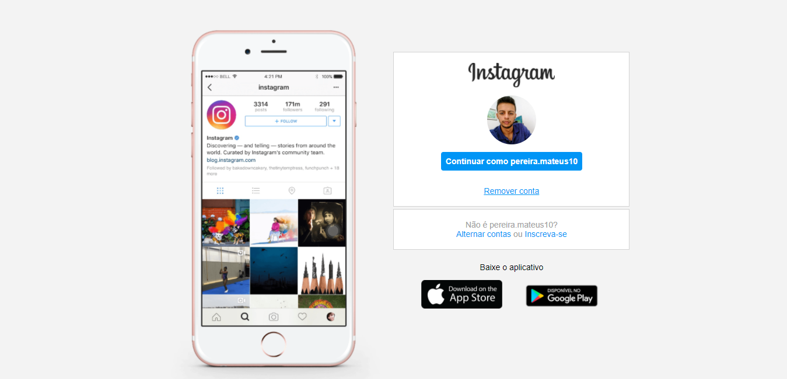
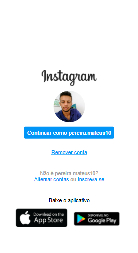

# Instagram-Clone
Clone da interface do instagram feita no Bootcamp Decola Dev Avanade e DIO, usando HTML e CSS.
 

:o: Conceitos abordados

<ul>
  <li>Semântica</li>
  <li>Flex-box</li>
  <li>Media-queries</li>
  <li>Responsividade</li>
</ul>

## Interface Web

 

## Interface Mobile

